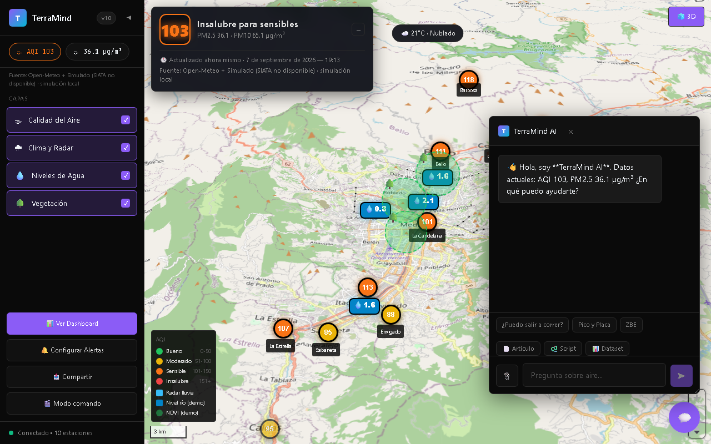
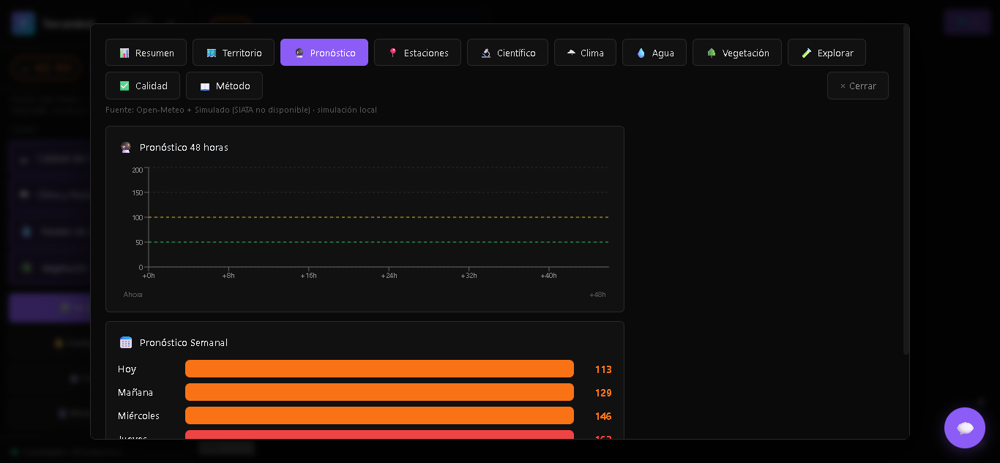
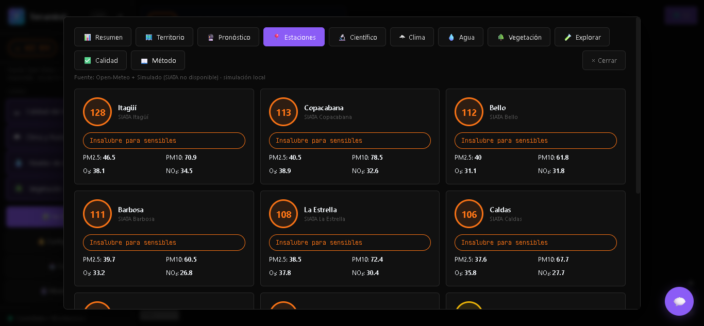

# 🌎 Terramind — Environmental Intelligence Platform

> **Plataforma fullstack de inteligencia ambiental para el Valle de Aburrá, Colombia: mapa 3D interactivo, datos en tiempo real de calidad del aire y clima, y copiloto conversacional con IA.**

**🚀 Demo en vivo:** https://terramind-mu.vercel.app

<p align="center">
  
  
  
  
  
  
  
  
  
</p>

## 📸 Capturas



*Mapa 3D del Valle de Aburrá con estaciones de calidad del aire (AQI/PM2.5), capas de clima y radar, y copiloto de IA integrado.*



*Dashboard analítico: pronóstico 48 horas, pronóstico semanal por municipio y tabs por tema (territorio, estaciones, clima, agua, vegetación).*



*Red de estaciones SIATA por municipio con AQI y contaminantes en tiempo real.*

## ✨ ¿Qué es?

**Terramind** es una aplicación fullstack que unifica visualización geoespacial 3D, redes de sensores en tiempo real e IA conversacional en un solo panel:

- 🗺️ **Mapa 3D interactivo** (MapLibre GL + deck.gl): estaciones de calidad del aire, radar de lluvia, niveles de agua y vegetación
- 🌫️ **Datos reales**: red de monitoreo SIATA, Open-Meteo y RainViewer, con modo demo sin conexión
- 🤖 **Copiloto de IA**: preguntas en lenguaje natural sobre los datos, con enrutamiento multi-proveedor (Groq, Gemini, OpenRouter)
- 📊 **Dashboards**: AQI, PM2.5/PM10, histórico, alertas y reportes por zona

## 🛠️ Stack

| Capa | Tecnologías |
|------|--------------|
| Frontend | React 18, TypeScript, Vite, Tailwind CSS, Zustand, Recharts, MapLibre GL, deck.gl |
| Backend | Python, FastAPI, Pydantic v2, enrutamiento multi-LLM |
| Datos | PostgreSQL + PostGIS, Redis, APIs REST (SIATA, Open-Meteo, RainViewer) |
| Calidad | Vitest + Testing Library (8 tests), ESLint, GitHub Actions (CI) |
| Deploy | Docker, Vercel (frontend), Railway/Fly.io (backend) |

## ⚡ Uso local (2 minutos, sin backend)

```bash
git clone https://github.com/Marusan94/Terramind.git
cd terramind/apps/web
npm install
npm run dev
# Abrir http://localhost:5173 — funciona en modo demo sin API keys
```

Con backend completo y API keys (opcionales), ver la instalación completa abajo.

<details>
<summary><strong>Instalación completa (backend + base de datos)</strong></summary>

```bash
# 1. Infraestructura (PostgreSQL + PostGIS + Redis)
docker compose up -d

# 2. Backend
cd apps/api
python -m venv .venv
.\.venv\Scripts\Activate.ps1   # Windows | source .venv/bin/activate en macOS/Linux
pip install -r requirements.txt
uvicorn app.main:app --reload --port 8000
# API Docs: http://localhost:8000/docs

# 3. Variables de entorno (opcionales — sin ellas activa modo demo)
cp .env.example .env
# Conseguir keys gratuitas: Gemini (aistudio.google.com/apikey), Groq (console.groq.com/keys)
```

</details>

## 🧪 Tests

```bash
cd apps/web && npm test        # 8 tests Vitest
cd apps/api && pytest          # tests backend
```

## 🏗️ Arquitectura

```
                React 18 + TypeScript (MapLibre + deck.gl)
                              │
                ┌─────────────┴─────────────┐
                │                           │
        🗺️ 3D MAP VIEWPORT           🤖 AI COPILOT (Groq/Gemini/OpenRouter)
                │                           │
                └─────────────┬─────────────┘
                              ▼
                       FASTAPI BACKEND
                              │
         ┌────────────────────┼────────────────────┐
         ▼                    ▼                    ▼
   PostGIS + Redis     SIATA / Open-Meteo    Caché de mosaicos
   (espacial)          / RainViewer          + modo demo
```

## 📚 Documentación

| Documento | Descripción |
|-----------|-------------|
| [01_ARCHITECTURE.md](./docs/engineering/01_ARCHITECTURE.md) | Arquitectura del sistema |
| [07_API_CONTRACT.md](./docs/engineering/07_API_CONTRACT.md) | Documentación de la API REST |
| [AGENTS.md](./AGENTS.md) | Guía del sistema multi-agente |
| [CONTRIBUTING.md](./CONTRIBUTING.md) | Cómo contribuir |

## 👨‍💻 Autor

**Santiago Marulanda** — *Desarrollador de Software* — [@Marusan94](https://github.com/Marusan94)
- Licenciatura en Ciencias Naturales y Educación Ambiental — Universidad de Antioquia
- Técnico en Desarrollo de Software — Cesde
- 📧 santiago.marulandal@udea.edu.co · 📍 Medellín, Colombia

## 📜 Licencia

Apache 2.0 — ver [LICENSE](./LICENSE).

## 🙏 Fuentes de datos

**SIATA** (Área Metropolitana del Valle de Aburrá) · **Open-Meteo** · **RainViewer** · **OpenStreetMap** · **MapLibre** · **deck.gl**

---

<p align="center"><strong>🌎 Pregunta a los datos. • 🤖 La IA responde. • 🗺️ El mapa lo muestra.</strong><br>Hecho en Medellín, Colombia</p>
